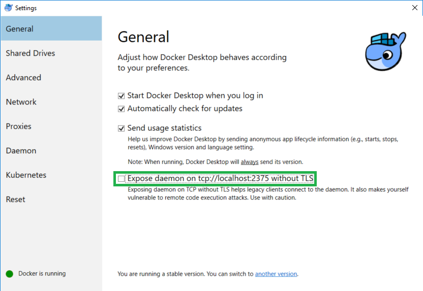
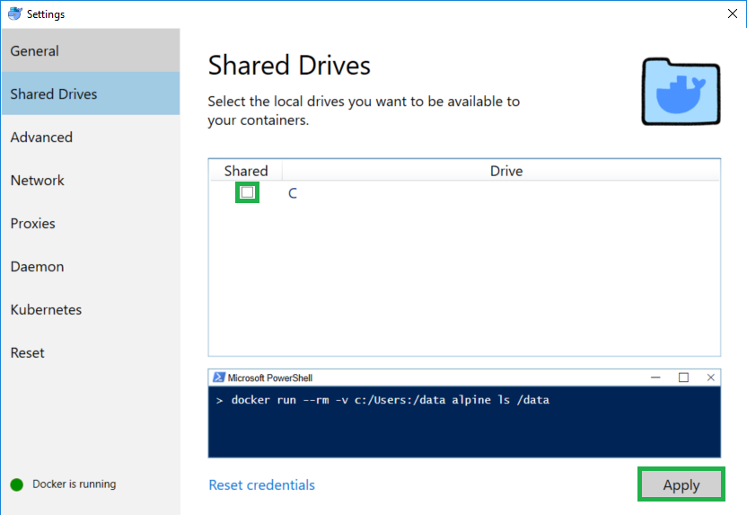

# cloud-notes
## A Cloud Agnostic deployment service for Python Notebooks

To enable developers and researchers to get up and running in the cloud without previous cloud provisioning knowledge or the time to learn the skills needed to setup a cloud environment.

## Getting Started
### Prerequisites
1. Access to a web browser on the local machine. This is used to complete login steps associated with each platform as well as viewing the notebboks in the Jupyter server once it is deployed either locally or in the cloud.

#### Linux
1. Install Docker using your distro's installation method. See Docker's provided installation instructions for it's [supported platforms](https://docs.docker.com/install/#supported-platforms).

#### Windows
1. Turn on optional features using the optional features tool here:  
   "C:\Windows\System32\OptionalFeatures.exe"

   Select the following features to enable:  
   a) Containers  
   b) Windows Subsystem for Linux  
   c) Hyper-V  

2. [Install Docker for Windows](https://docs.docker.com/docker-for-windows/install/).
3. Expose Docker daemon on tcp://localhost:2375
   
4. Give docker drive access
   
5. Add a wsl.conf file to change the auto mount settings in WSL:

   ```
   [automount]
   root    = /
   options = "metadata"
   ```

## Deployment
1. Place all Jupyter notebooks and code dependencies in the workspace folder.  

2. Run the `./deploy.sh <PROVIDER>`  command with the public cloud platform provider of choice. See the table below for valid arguments. In order to deploy to a cloud platform, you must have the appropriate subscription to the platform.

|     Cloud Platform    | Argument |          NOTES          |
|:----------------------|:--------:|-------------------------|
| Local Jupyter Server  | local    |                         |
| Amazon Web Services   | aws      | *Currently unsupported* |
| Google Cloud Platform | gcp      |                         |
| IBM Cloud             | ibm      | *Currently unsupported* |
| Microsoft Azure       | az       |                         |

---

### Notes

**__LOCAL__**: Any changes you make in the locally running container should be reflected on the local machine. You can also add more files to the workspace without the need to restart the container and the server should reflect those changes. Use this feature to ensure the container is capable of running th application before running the deploy.sh script to run the service in the cloud.

**__REMOTE__**: Getting the login key on from the server currently requires accessing the remote URL and then reading through the console output to find a string that indicates what the ogin token is. The token will appear in the following form `:8888/?token=XXXXXXXXXXXXXXXXXXXXXXXXXXXXXXXXXXXXXXXXXXXXXXXX`
