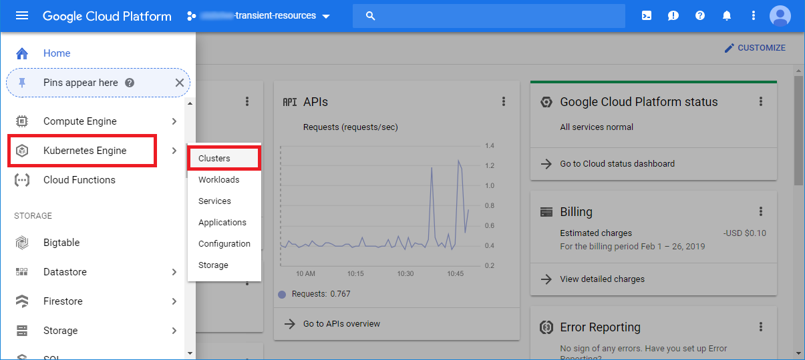
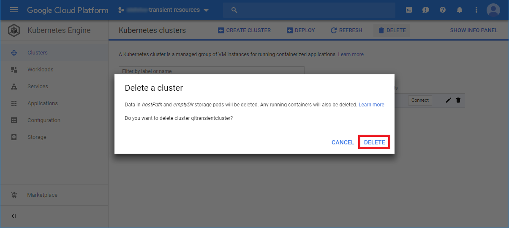

# Resource Cleanup

Until automatic resource cleanup is implemented, follow the directions for the specific platform to cleanup the transient resources created when launching this application.

## GCP
1. Navigate to the [Google Cloud Console](https://console.cloud.google.com).
   
2. Select your Project
   
3. Select the [Hamburger Icon](https://rnoldzwicky.org/2018/know-your-menu).
   
4. Select Google Kubernetes Engine
   
5. Delete qitransientcluster
   
   

