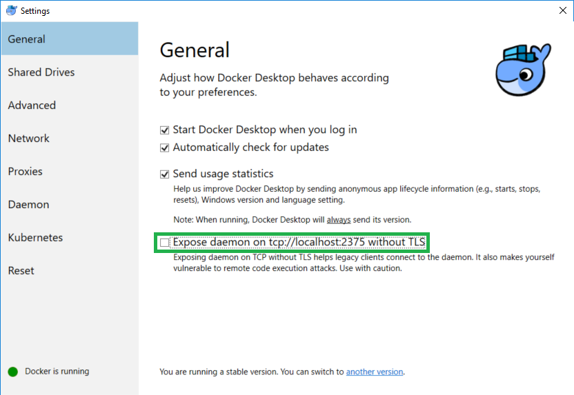
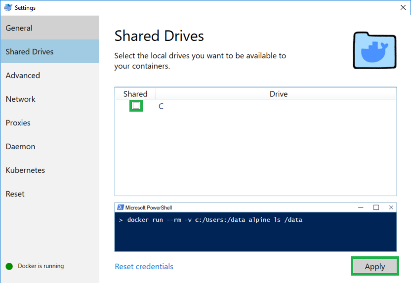

# Windows Setup

1. [Manual Installation Process](#manual)
2. [Automated Installation](#automated) (not fully supported)

**NOTE**:  
According to the official docker documentation, in order for Windows to work with docker,
The System _MUST_ meet the following specifications:

> - Windows 10 64bit: Pro, Enterprise or Education (1607 Anniversary Update, Build 14393 or later).
> - Virtualization is enabled in BIOS. Typically, virtualization is enabled by default.
>   This is different from having Hyper-V enabled. For more detail see Virtualization must
>   be enabled in Troubleshooting.
> - CPU SLAT-capable feature.
> - At least 4GB of RAM.

<a href="" id="manual"></a>
##### Manual Installation
1. Turn on optional features using the optional features tool here:  
   "C:\Windows\System32\OptionalFeatures.exe"

   Select the following features to enable:  
   a) Containers  
   b) Windows Subsystem for Linux  
   c) Hyper-V  

2. [Install Docker for Windows](https://docs.docker.com/docker-for-windows/install/).
3. Expose Docker daemon on tcp://localhost:2375
   
4. Give docker drive access
   
5. Add a WSL configuration file `/etc/wsl.conf` to change the auto mount settings in WSL:

   ```
   [automount]
   root    = /
   options = "metadata"
   ```

<a href="" id="automated"></a>
##### Automated Install script
Provided in this repository is powershell script intended to install all the necessary components
for windows development called `win-setup.ps1`. To execute the script, run the following command
from the source directory. You will still need to share the correct drives within docker desktop
and add a wsl.conf file in the wsl distribution.
```
Set-ExecutionPolicy Bypass -Scope Process -Force; iex (win-setup.ps1)
```


